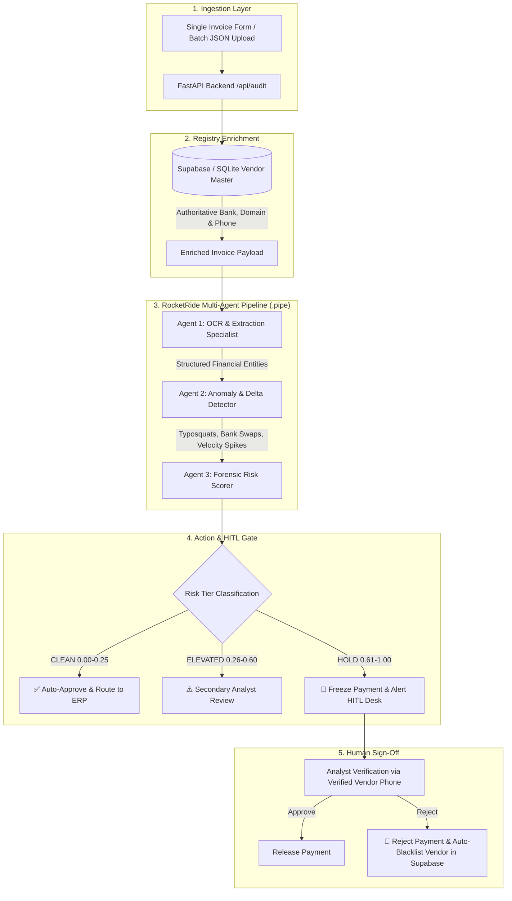

# 🏆 AP Payment Fraud Sentinel — Winning Pitch Deck & Architecture Guide
**Built for the RocketRide Buildathon · Load-Bearing Multi-Agent AI System**

---

## Executive Summary
**AP Payment Fraud Sentinel** is an automated, multi-agent financial security system designed for mid-size Accounts Payable (AP) finance teams. It intercepts, screens, and blocks Business Email Compromise (BEC), fake bank-detail swaps, and vendor impersonation attacks before money leaves the bank. 

---

## 🎯 Winning Slide Deck Structure (10-Slide Template)

```
┌────────────────────────────────────────────────────────────────────────┐
│  SLIDE 1: Title & Hook                                                 │
│  "AP Payment Fraud Sentinel: The Autonomous Defense Gate for Mid-Market B2B Payments" │
├────────────────────────────────────────────────────────────────────────┤
│  SLIDE 2: The Problem                                                  │
│  - BEC fraud is the #1 cyber threat to finance teams ($2.9B lost/yr).  │
│  - Avg loss per incident: $130,000.                                    │
│  - AP teams process 500+ invoices/mo; humans miss subtle typosquats.   │
├────────────────────────────────────────────────────────────────────────┤
│  SLIDE 3: The Solution                                                 │
│  - Real-time 3-agent RocketRide pipeline screening every invoice.     │
│  - Automatic cross-referencing against Supabase Vendor Master data.    │
│  - Strict Human-in-the-Loop (HITL) gate for any suspicious signal.     │
├────────────────────────────────────────────────────────────────────────┤
│  SLIDE 4: Architecture & RocketRide Multi-Agent Pipeline               │
│  - [Agent 1: OCR Extraction] -> [Agent 2: Delta Anomaly Detector]      │
│    -> [Agent 3: Forensic Risk Scorer]                                  │
├────────────────────────────────────────────────────────────────────────┤
│  SLIDE 5: Supabase Auth & Vendor Master Registry                       │
│  - Authoritative bank accounts, routing, aliases & verified phone #s.  │
│  - Zero demo data reliance: live CRUD + auto-blacklisting on fraud.    │
├────────────────────────────────────────────────────────────────────────┤
│  SLIDE 6: Human-in-the-Loop (HITL) Hold Desk                           │
│  - High-risk payments frozen automatically.                            │
│  - Enforces out-of-band phone call verification using master phone #.  │
├────────────────────────────────────────────────────────────────────────┤
│  SLIDE 7: Live Batch Streaming & Telemetry                             │
│  - SSE streaming for large batches with real-time risk gauges.         │
│  - Sub-second per-invoice analysis (<500ms).                           │
├────────────────────────────────────────────────────────────────────────┤
│  SLIDE 8: Resilience & Cost Model                                      │
│  - Groq primary (ultra-fast) + Gemini fallback on rate-limits.         │
│  - Predictable cost: $0.00 / free tier compute; ROI is instantaneous.  │
├────────────────────────────────────────────────────────────────────────┤
│  SLIDE 9: Market & Monetization                                        │
│  - $0.25 per screened invoice + 2% of prevented fraud losses.          │
│  - Target: Mid-market companies paying 200–5,000 invoices/month.       │
├────────────────────────────────────────────────────────────────────────┤
│  SLIDE 10: Team & Roadmap                                              │
│  - ERP Integrations (NetSuite, QuickBooks, SAP).                       │
│  - Voice AI Agent for automated out-of-band vendor call verification.  │
└────────────────────────────────────────────────────────────────────────┘
```

---

## 🔄 End-to-End System Workflow



---

## 💡 How AP Payment Fraud Sentinel Meets Every Judging Criterion

| Judging Criterion | How We Win |
|---|---|
| **Is it a Real App?** | Strangers can sign in via Supabase Auth, register vendors, upload invoice batches, and see instant live forensic analysis without training. |
| **Would Someone Pay?** | Mid-market AP managers lose an average of $130K per BEC incident. Preventing a single attack pays for years of subscription. |
| **Is RocketRide Load-Bearing?** | Uses a 3-agent `.pipe` DAG (`ocr_parser` &rarr; `anomaly_delta` &rarr; `forensic_scorer`) where specialist agents analyze structured data sequentially. |
| **Volume & Scale** | Handles single real-time audits and multi-file batch uploads via Server-Sent Events (SSE) streaming with sub-second latency. |
| **Knows When to Stop (HITL)** | High-risk payments (`HOLD`) are frozen; zero high-risk payments are auto-released without human verification using the vendor's registered phone number. |
| **Predictable Cost & Resilience** | Primary Groq inference ($0.00 / free tier) with Gemini 1.5/Flash-Lite fallback and graceful `_error_verdict` handling for bad input. |

---

## 📊 Live Demo Script for Presentation

1. **Sign In**: Show the Supabase login modal and active user session badge.
2. **Vendor Registry**: Show the registered vendor table (e.g. `Cloudflare Global Services` on `cloudflare.com` with verified bank details).
3. **Trigger Fraud Audit**:
   - Go to **Audit Invoice** tab.
   - Click **"⚡ Pre-fill Spoofed BEC Example"** (`cloudf1are.com` spoofing Cloudflare with a new bank account and executive urgency memo).
   - Click **"Run Forensic Fraud Audit"**.
4. **Show Verdict**:
   - Watch the gauge hit **Risk Score 0.95 - HOLD**.
   - Show detected anomalies: `Typosquatting detected (cloudf1are vs cloudflare)`, `Bank account mismatch`, `Urgency language flagged`.
   - Highlight the **Mandatory Out-of-Band Call Action** showing the verified registry phone number.
5. **Resolve Hold**:
   - Click **"🚫 Reject & Blacklist"**.
   - Show that the invoice is rejected and the vendor in Supabase is immediately updated to **`BLACKLISTED`**.
6. **Show Batch Streaming**:
   - Go to **Batch Upload** & drop a batch to show live SSE progress and real-time fraud held metrics.
